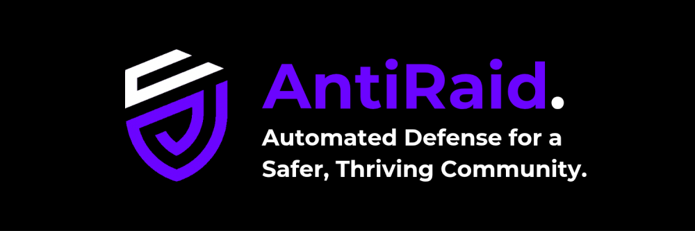

# 🛡️ AntiRaid Documentation

<div align="center">



Your Discord server's intelligent guardian against raids and nukes.

[](https://antiraid.xyz/discord)
[](https://docs.antiraid.xyz)
[](LICENSE)

</div>

## ✨ What Makes AntiRaid Special?

AntiRaid revolutionizes Discord server protection with its unique approach to security. Unlike traditional anti-raid bots, we empower you with:

- 🎯 **Structured Templating** - Create custom security workflows using Lua
- 🔒 **Smart Lockdowns** - Multiple defense modes for different threat levels
- 💾 **Reliable Backups** - Peace of mind with complete server state preservation
- 🤖 **Advanced Captcha** - Keep the bots out, let real users in
- 🎮 **Granular Controls** - Fine-tune every aspect of your server's security

## 🚀 Quick Start

### Using AntiRaid Bot

1. [Add AntiRaid to your server](https://antiraid.xyz/invite)
2. Read our [Getting Started Guide](https://docs.antiraid.xyz/docs/user/)

### Running the Docs Locally

```bash
# Clone the repository
git clone https://github.com/Anti-Raid/thaumodynamics-next.git
cd thaumodynamics-next

# Install dependencies (choose one)
npm install
# or
bun install
# or
yarn install

# Start the development server
npm run dev
```

Visit [http://localhost:3000](http://localhost:3000) to see the docs in action! 🎉

## 📚 Documentation Sections

- 📘 [User Guide](https://docs.antiraid.xyz/docs/user/) - Everything for server admins
- 🛠️ [Developer Guide](https://docs.antiraid.xyz/docs/dev/) - API integration and advanced features
- 🔧 [Self-Hosting](https://docs.antiraid.xyz/docs/dev/hosting/) - Run your own instance

## 🌟 Key Features

### Templating System

Create custom responses, automate moderation, and design complex workflows using our powerful Lua-based templating system.

### Smart Backups

- 📦 Complete server structure preservation
- ⚡ Quick restoration process
- 🔄 Automated backup scheduling

## 🤝 Contributing

We love contributions! Whether it's:

- 🐛 Bug Reports
- 💡 Feature Suggestions
- 📝 Documentation Improvements
- 🎨 UI Enhancements

## 📜 License

This project is licensed under the MIT License - see the [LICENSE](LICENSE) file for details.

---

<div align="center">

Built with ❤️ by Team Purrquinox | [Website](https://antiraid.xyz) | [Documentation](https://docs.antiraid.xyz)

</div>
